# hypa-ttfx

A C# / .NET 10 Native-AOT parity port of [ttfx](https://github.com/omacom-io/ttfx) — a
single-binary terminal text-effects CLI with 37 effects. Pipe text in, pick an effect:

```sh
printf 'Hello\n' | ./artifacts/ttfx wipe
fortune | ./artifacts/ttfx --random-effect
```

## Examples

Every clip is [`hypa-logo.txt`](hypa-logo.txt) piped through that effect with `--seed 42`.

<p align="center">
  
</p>

| beams | binarypath | blackhole |
| :---: | :---: | :---: |
|  | 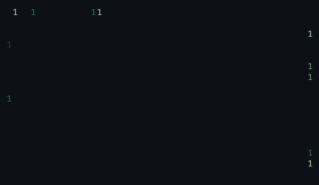 | 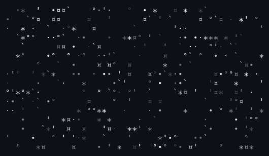 |
| **bouncyballs** | **bubbles** | **burn** |
|  |  | 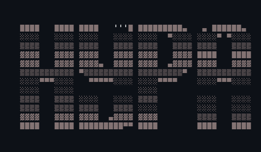 |
| **colorshift** | **crumble** | **decrypt** |
| 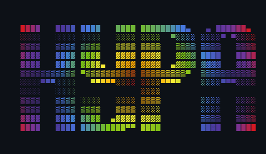 | 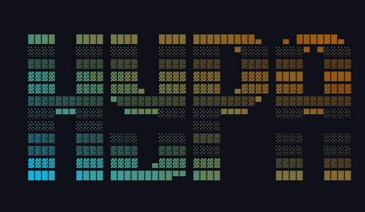 |  |
| **errorcorrect** | **expand** | **fireworks** |
| 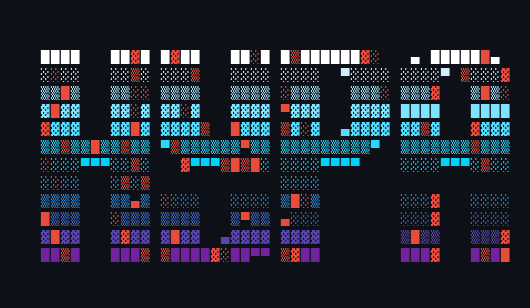 | 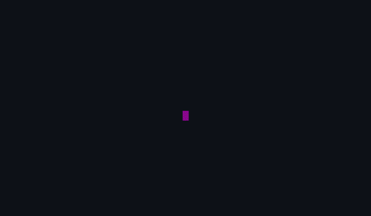 | 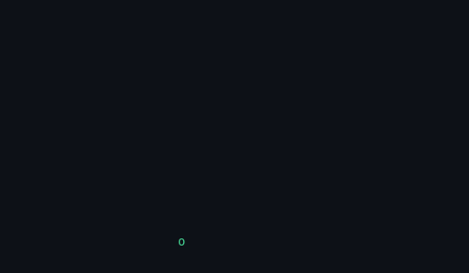 |
| **highlight** | **laseretch** | **matrix** |
|  | 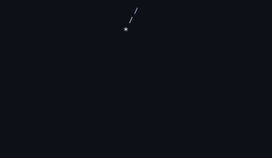 | 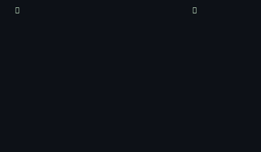 |
| **middleout** | **orbittingvolley** | **overflow** |
| 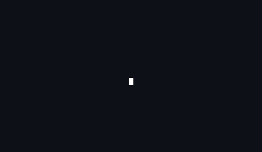 | 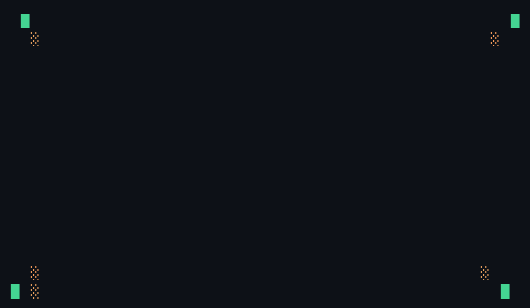 | 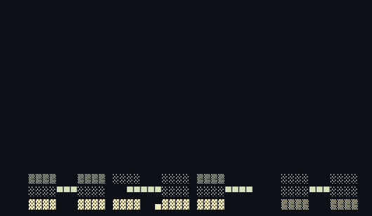 |
| **pour** | **print** | **rain** |
| 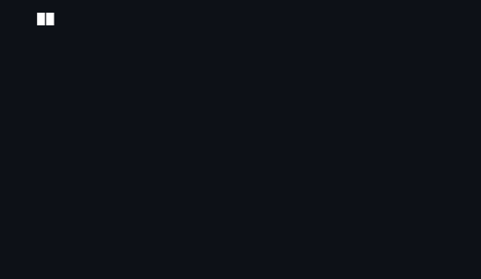 | 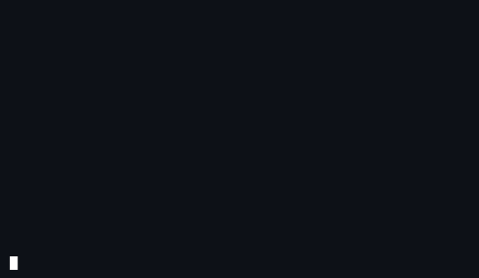 | 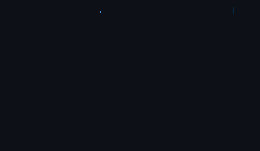 |
| **randomsequence** | **rings** | **scattered** |
| 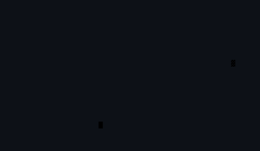 | 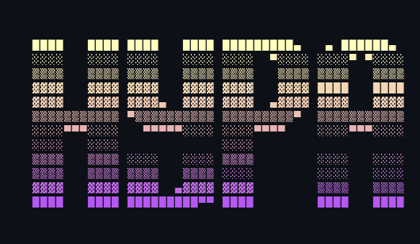 | 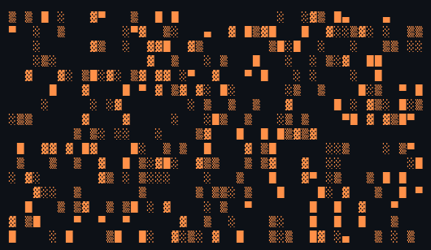 |
| **slice** | **slide** | **smoke** |
|  |  | 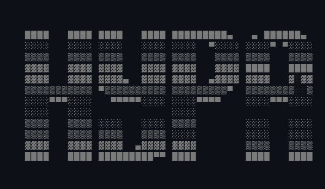 |
| **spotlights** | **spray** | **swarm** |
| 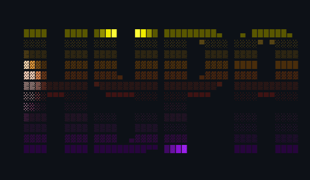 | 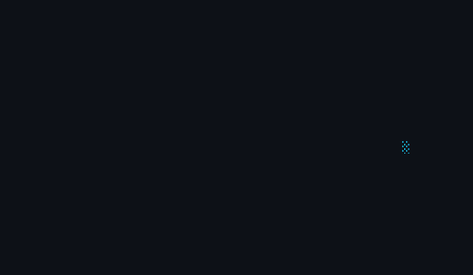 |  |
| **sweep** | **synthgrid** | **thunderstorm** |
|  | 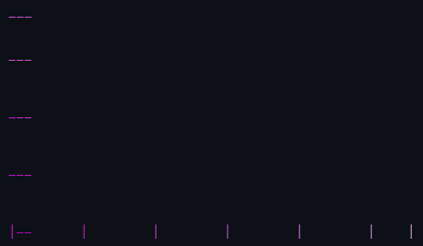 | 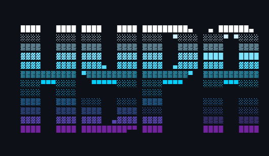 |
| **unstable** | **vhstape** | **waves** |
| 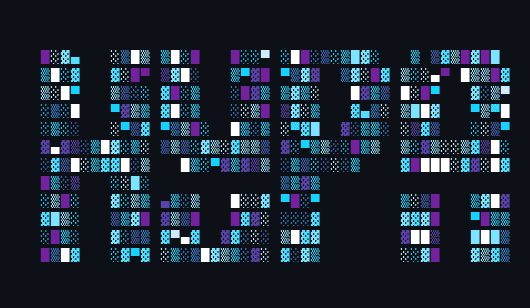 | 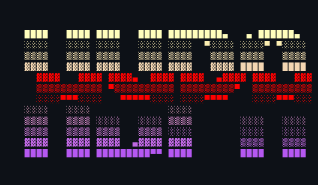 | 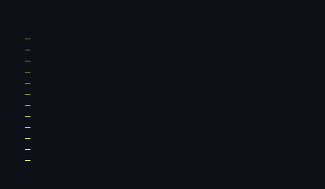 |

Regenerate with `./bin/build` and `tools/render_examples.py` (Pillow + ffmpeg).

## Credit where it's due

**This is a port of a port.** Every effect, the animation engine, and the CLI are
[ChrisBuilds](https://github.com/ChrisBuilds)' design in
[TerminalTextEffects](https://github.com/ChrisBuilds/terminaltexteffects) (TTE).
[ttfx](https://github.com/omacom-io/ttfx) translated that work to Rust; this project
translates ttfx to C# and adds nothing to the art. If you like what you see here, star
the upstream projects.

Attribution details are in [LICENSE](LICENSE) and [NOTICE](NOTICE). Effect *ideas*
belong upstream.

## Deliberate divergences

| Topic | Behavior here | Why |
|---|---|---|
| Random number generator | xoshiro256++ (same as ttfx) | Inherited from ttfx; `--seed` matches ttfx and this port, not Python TTE's Mersenne Twister |
| Broken-pipe exit status | 0 | Upstream Python swallows `EPIPE`; we match that contract |
| SIGTERM exit status | Matches ttfx (signal 15 via `WIFSIGNALED`) | Not a divergence |
| Shell completions | Hand-written templates | Zero NuGet packages — no `clap_complete`; text differs from ttfx's generated scripts |
| Plugin effects | Not supported | No Python interpreter to load them |
| Cell width | One codepoint = one cell (`Rune`) | Faithfully reproduces upstream; no `wcwidth` |
| Byte-exact parity | Verified on tested RIDs only | See **Fidelity** below |

## Fidelity

This is a *parity port*: given the same input, config, and seed, hypa-ttfx aims for
**byte-identical frame output** to the pinned ttfx binary (`REFERENCE.md`).

**Verified on this project's CI / local testing:**

| RID | Status |
|---|---|
| `osx-x64` | Verified locally (AOT publish on this developer host) |
| `osx-arm64` | Expected on Apple Silicon hosts (same gate; build with `./bin/build osx-arm64`) |
| `linux-x64` | Verified in CI (oracle suites behind Linux gate) |
| `linux-arm64` | Expected but unverified until a matching CI runner executes the oracle suites |

Publishing four RIDs under a claim tested on one machine would overclaim — maths-library
behavior, AOT codegen, and signal delivery can differ by architecture. The README states
what has actually been measured.

`./bin/test` runs the full gate: unit goldens, AOT publish, CLI corpus, signal tests, and
(on Linux or when `reference/ttfx` is present on macOS) byte-exact parity suites.

## Building

```sh
./bin/build              # AOT publish to artifacts/ttfx (host RID)
./bin/build linux-x64    # cross-RID publish when toolchain is available
./bin/test
```

Zero NuGet packages — everything comes from `Microsoft.NETCore.App`.

## Usage

```
<producer> | ttfx [terminal options] <effect> [effect options]

ttfx --help
ttfx <effect> --help
ttfx --random-effect        # --include-effects / --exclude-effects to filter
ttfx --print-completion bash|zsh
```

Terminal options go before the effect name; effect options after it. Names and defaults
match ttfx / TTE.

## Reference pins

See [REFERENCE.md](REFERENCE.md) for the pinned ttfx and upstream TTE commits.
